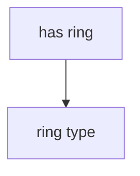

# data_analysis_hse

## Граф зависимостей



## Структура параметров

Каждый параметр должен иметь вид:
```
"parameter-name": {

Обязательные поля:
    "type": "parameter-type",

Необязательные поля:
    "image": "path-to-image",
    "possible-values": ["possible", "values"],
    "prerequisites": ["parent1", "parent2"]

}
```
Если `prerequisites` не пусты, то блок для ввода данного параметра
будет отображаться  или не отображаться в зависимости от значения каждого
реквизита.
