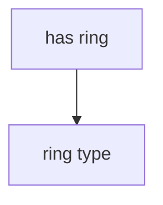

# Приложение по анализу данных о грибах различных видов и классификации ядовитости на основе модели машинного обучения

Проект представляет собой приложение, разработанное с использованием библиотеки [Gradio](https://www.gradio.app/), что позволяет формировать текстовые и графические отчеты на основе введенных параметров. Кроме того, была интегрирована модель машинного обучения, которая бинарно определяет ядовитость гриба. 
## Граф зависимостей



## Структура параметров

Каждый параметр должен иметь вид:

```
"parameter-name": {

Обязательные поля:
    "type": "parameter-type",

Необязательные поля:
    "image": "path-to-image",
    "possible-values": ["possible", "values"],
    "prerequisites": ["parent1", "parent2"]

}
```

Если `prerequisites` не пусты, то блок для ввода данного параметра
будет отображаться или не отображаться в зависимости от значения каждого
реквизита.

## Описание работы приложения

После ввода всех параметров модель выдаёт бинарный ответ — `является ли гриб ядовитым или нет.`

Затем, при каждом вводе данных и нажатии кнопки `“Submit”`, формируются графические и текстовые отчёты, которые автоматически сохраняются в папку `/graphics`.

## Описание запуска приложения

Перейдите в папку work и создайте виртуальное окружение

```bash
cd work
python -m venv .venv
```

Активируйте виртуальное окружение:

**Windows:**

```bash
.venv\Scripts\activate
```

**Linux/macOS:**

```bash
source .venv/bin/activate
```

Установите зависимости:

```bash
pip install -r requirements.txt
```

Запуск

```bash
python scripts/main_interface.py
```

## Авторы

1. Андреев Александр
2. Ро Александр
3. Чапайкин Арсений
4. Шмелев Антон
