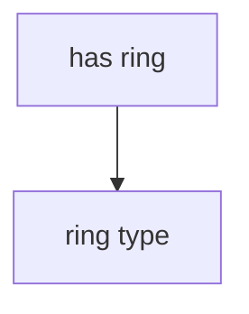

# data-analysis-hse

## Примечание

MS Excel позволяет записать около 1 млн. строк на одном листе, но наш датасет содержит более 3 млн. строк. По этой причине основной датасет хранится в отдельном файле `dataset.csv`. В `store.xlsx` содержится прототип базы данных с описанием каждой из фич, а также справочники с их возможными значениями.

## Граф зависимостей



## Структура параметров

Каждый параметр должен иметь вид:

```
"parameter-name": {

Обязательные поля:
    "type": "parameter-type",

Необязательные поля:
    "image": "path-to-image",
    "possible-values": ["possible", "values"],
    "prerequisites": ["parent1", "parent2"]

}
```

Если `prerequisites` не пусты, то блок для ввода данного параметра
будет отображаться или не отображаться в зависимости от значения каждого
реквизита.

## Запуск

> Для запуска необходима версия Python >=3.13

### Создание виртуального окружения

```
python -m venv .venv
```

### Активация окружения

Linux/macOS

```
source .venv/bin/activate
```

Windows

```
.venv\Scripts\activate
```

### Установка зависимостей

```
pip install -r ./requirements.txt
```

### Запуск

```
python ./scripts/main_interface.py
```
